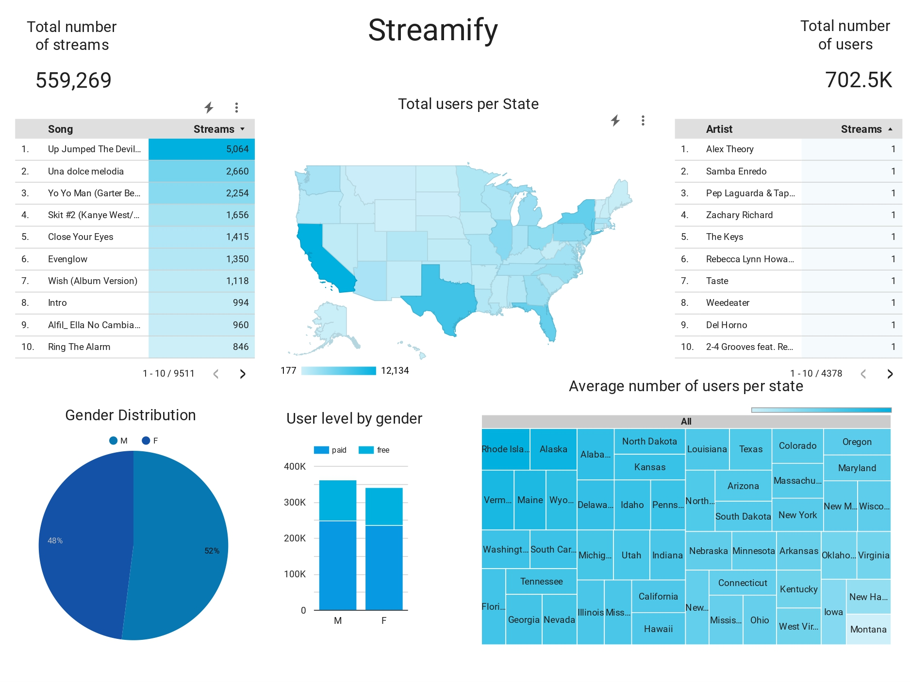
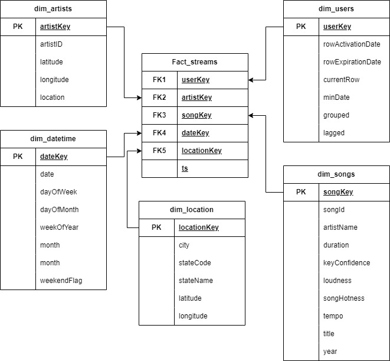

# Streamify

A data pipeline with Kafka, Spark Streaming, dbt, Docker, Airflow, Terraform and GCP.

## Introduction 

The following has been forked from [ankurchavda](https://github.com/ankurchavda/streamify) with the original course coming from [DataTalks.club](https://www.youtube.com/live/-zpVha7bw5A?feature=share). I made some minor adaptions to increase the Quality of Life, but additional development will be coming soon so check out the next steps section.

## Description

### Objective

The project will stream events generated from a fake music streaming service (like Spotify) and create a data pipeline that consumes the real-time data. The data coming in would be similar to an event of a user listening to a song, navigating on the website, authenticating. The data would be processed in real-time and stored to the data lake periodically (every two minutes). The hourly batch job will then consume this data, apply transformations, and create the desired tables for our dashboard to generate analytics. We will try to analyze metrics like popular songs, active users, user demographics etc.

### Tools & Technologies

- Cloud - [**Google Cloud Platform**](https://cloud.google.com)
- Infrastructure as Code software - [**Terraform**](https://www.terraform.io)
- Containerization - [**Docker**](https://www.docker.com), [**Docker Compose**](https://docs.docker.com/compose/)
- Stream Processing - [**Kafka**](https://kafka.apache.org), [**Spark Streaming**](https://spark.apache.org/docs/latest/streaming-programming-guide.html)
- Orchestration - [**Airflow**](https://airflow.apache.org)
- Transformation - [**dbt**](https://www.getdbt.com)
- Data Lake - [**Google Cloud Storage**](https://cloud.google.com/storage)
- Data Warehouse - [**BigQuery**](https://cloud.google.com/bigquery)
- Data Visualization - [**Data Studio**](https://datastudio.google.com/overview)
- Language - [**Python**](https://www.python.org)

### Technology Architecture


### Infrastructure Architecture
TBC

### Dashboard


## Setup

### Pre-requisites
This project is built in a manner that a basic level of knowledge for docker, terrform and python is assumed. If you are unfamilar with those aspects it is advised to take a step back and learn the technologies before attempting the above or be ready to google. 

**WARNING: You will be charged for all the infrastructre setup. If you create a new account on Google Cloud you can take advantage of the free $300 credits you recieve.**

### Google Cloud 

1. Create an account with your Google email. 
2. Setup a [project](https://console.cloud.google.com/), eg. "Streamify".
3. Setup [service account & authentication](https://cloud.google.com/docs/authentication/getting-started) for the project.
    * Grant the following roles to a service user (Viewer, Storage Admin, Storage Object Admin, BigQuery Admin).
    * Download service-account-keys (`.json`) for auth. (Keep it secure!)
    * Rename the `.json` key file to `google_credentials.json`
4. Enable the following APIs for the project:
    * https://console.cloud.google.com/apis/library/iam.googleapis.com
    * https://console.cloud.google.com/apis/library/iamcredentials.googleapis.com
    * https://console.cloud.google.com/apis/library/logging.googleapis.com
    * https://console.cloud.google.com/apis/library/bigquery.googleapis.com
    * https://console.cloud.google.com/apis/library/compute.googleapis.com

  Please note that the above list is not exhaustive and additional APIs might need to be enabled.

4. Setup the google cloud [SDK](https://cloud.google.com/sdk/docs/quickstart) on your local setup
5. Set the environment variable to point to your downloaded GCP keys:
  ```
   export GOOGLE_APPLICATION_CREDENTIALS="<path/to/your/google_credentials.json>"
  ```
6. Refresh the token/session, and verify authentication
  ```
  gcloud auth application-default login
  ```

### Terraform
- Initiate terraform and download the required dependencies.
  ```
  terraform init
  ```
- Set the follow variables in the variables.tf file
  * project
  * region
  * zone 

- View the Terraform plan

  ```
  terraform plan
  ```
- Apply the infra. **Note** - Billing will start as soon as the apply is complete.

  ```
  terraform apply
  ```
### SSH Access
- Create an ssh key in your local system if one does not exists.
- Add the public key (`.pub`) to your [project](https://cloud.google.com/compute/docs/connect/add-ssh-keys#expandable-2).
- Create a config file in your `.ssh` folder
  ```
  touch ~/.ssh/config
  ```
- Copy the following snippet and replace fill in the External IP, Username and path to the ssh private key. Note: The IP of the VMs will change if they are restarted and the below values will have to be replaced with the new IPs.

    ```
    Host streamify-kafka
        HostName <External IP Address>
        User <username>
        IdentityFile </home/username/.ssh/keyfile>

    Host streamify-spark
        HostName <External IP Address Of Master Node>
        User <username>
        IdentityFile </home/username/.ssh/keyfile>

    Host streamify-airflow
        HostName <External IP Address>
        User <username>
        IdentityFile </home/username/.ssh/keyfile>
    ```
- SSH into the servers using the Host field specified in the config file. For example:
    ```
    ssh streamify-kafka
    ```
### Kafka

- SSH into the kafka VM.
  ```
  ssh streamify-kafka
  ```

- Clone the git repo

  ```bash
  git clone https://github.com/kyle1cooper/streamify.git
  ```

- Install anaconda, docker & docker-compose.
  ```
  bash ~/streamify/scripts/vm_setup.sh && exec newgrp docker
  ```
- Set the environemental variables
    ```
    export KAFKA_ADDRESS=IP ADDRESS
    ```
- Build the docker images
  ```
  docker-compose build
  ```
### Spark 
- Establish SSH connection to the **master node** Spark VM.

  ```
  ssh streamify-spark
  
- Clone the git repo

  ```
  git clone https://github.com/ankurchavda/streamify.git
  ```
### Airflow
- SSH into the airflow VM.

  ```
  ssh streamify-airflow
  ```
- Clone git repo 
  ```
  git clone https://github.com/kyle1cooper/streamify.git
  ```
- Install anaconda, docker & docker-compose.
  ```
  bash ~/streamify/scripts/vm_setup.sh && exec newgrp docker
  ```
- Move the service account json file from local to the VM machine in `~/.google/credentials/` directory.  Make sure it is named as `google_credentials.json`  else the dags will fail!

## Run the stack
The stack needs to be run in the following order:
1. Kafka
2. Eventsim
3. Spark
4. Airflow

### Kafka

- Set the evironment variables
- SSH into the kafka vm
- Set environemental variables
  ```
  export KAFKA_ADDRESS=IP ADDRESS
  ```

  **Note**: You will have to setup these env vars every time you create a new shell session. Or if you stop/start your VM

- Start Kafka 

  ```
  cd ~/streamify/kafka && \
  docker-compose up 
  ```

  **Note**: Sometimes the `broker` & `schema-registry` containers die during startup. You should just stop all the containers with `docker-compose down` and then rerun `docker-compose up`.

### Eventsim
- SSH into the kafka VM.
- Start Eventsim.

  ```
  bash ~/streamify/scripts/eventsim_startup.sh
  ```

This will start creating events for 1 Million users spread out from the current time to the next 24 hours. 
The container will run in detached mode. Follow the logs to see the progress.

- To follow the logs

  ```
  docker logs --follow million_events
  ```
- You should see four topics -

  - listen_events
  - page_view_events
  - auth_events
  - status_change_events
  

### Spark
- SSH into the **master node** Spark VM.
- Set the evironment variables 
  - External IP of the Kafka VM so that spark can connect to it
  - Name of your GCS bucket. (What you gave during the terraform setup)
  ```
  export KAFKA_ADDRESS=IP.ADD.RE.SS
  export GCP_GCS_BUCKET=bucket-name
  ```

  **Note**: You will have to setup these env vars every time you create a new shell session. Or if you stop/start your cluster

- Start reading messages

  ```
  spark-submit \
  --packages org.apache.spark:spark-sql-kafka-0-10_2.12:3.1.2 \
  stream_all_events.py
  ```

- If all went right, you should see new `parquet` files in your bucket! That is Spark writing a file every two minutes for each topic.

- Topics we are reading from

  - listen_events
  - page_view_events
  - auth_events

### Airflow
- SSH into the airflow VM.

  ```
  ssh streamify-airflow
  ```
- Set the evironment variables (same as Terraform values)-
  ```
  export GCP_PROJECT_ID=project-id
  export GCP_GCS_BUCKET=bucket-name
  ```
  **Note**: You will have to setup these env vars every time you create a new shell session.

- Start Airflow. (This shall take a few good minutes, grab a coffee!)

  ```
  bash ~/streamify/scripts/airflow_startup.sh && cd ~/streamify/airflow
  ```
##### DAGs

The setup has two dags
- `load_songs_dag`
  - Trigger first and only once to load a onetime song file into BigQuery
- `streamify_dag`
  - Trigger after `load_songs_dag` to make sure the songs table table is available for the transformations
  - This dag will run hourly at the 5th minute and perform transformations to create the dimensions and fact.

  - DAG Flow -
    - We first create an external table for the data that was received in the past hour.
    - We then create an empty table to which our hourly data will be appended. Usually, this will only ever run in the first run.
    - Then we insert or append the hourly data, into the table.
    - And then, delete the external table.
    - Finally, run the dbt transformation, to create our dimensions and facts.


### Debug

#### General Guidelines

- Always make sure the ENV variables are set
- Start the processes in this order - Kafka -> Eventsim -> Spark Streaming -> Airflow
- Monitor the CPU utilization for your VMs to see if something's wrong

#### Kafka
- Sometimes the `broker` & `schema-registry` containers die during startup, so the control center might not be available over 9021. You should just stop all the containers with `docker-compose down` or `ctrl+C` and then rerun `docker-compose up`.
- Did not set the `KAFKA_ADDRESS` env var. Kafka will then write to localhost, which will not allow Spark to read messages.

#### Eventsim
- If you start with a high number of users - 2-3 Million+, then eventsim sometimes might not startup and get stuck at generating events. Lower the number of users. Start two parallel processes with users divided.
#### Spark

- > Connection to node -1 (localhost/127.0.0.1:9092) could not be established. Broker may not be available.
  
  Make sure that the `KAFKA_ADDRESS` env variable is set with the external IP Address of the Kafka VM. If it's set and things still don't seem to work, restart the cluster :/.

#### Airflow

- Permission denied to dbt for writing logs
  - The `airflow_startup.sh` handles changing permission for the dbt folder, so you should be good. In case you happen to delete and recreate the folder, or not run the `airflow_startup.sh` script in the first place, then change the dbt folder permissions manually -
    ```bash
    sudo chmod -R 777 dbt/
    ```

## Data
### Eventsim

The dataset is generated by [Eventsim](https://github.com/Interana/eventsim) which creates replicate page requests for a fake music web site. The docker image is borrowed from [viirya's fork](https://github.com/viirya/eventsim) of it, as the original project has gone without maintenance for a few years now.

Eventsim uses song data from [Million Songs Dataset](http://millionsongdataset.com) to generate events. A [subset](http://millionsongdataset.com/pages/getting-dataset/#subset) of 10000 songs is used.

### Data Model
The logical model for the reporting dataset is as follows:



## Next Steps
The following is currently in development:
- Include the cloud infrastructure for Azure & AWS.
- Ensure that the services can be run through docker containers.
- CI/CD.
- Create your own VPC network.
- Build dimensions and facts incrementally instead of full refresh.
- Write data quality tests.
- Add more visualizations.